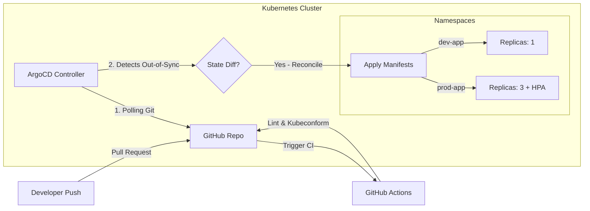

# Enterprise GitOps Continuous Delivery with ArgoCD & Kubernetes

[](https://github.com/arshad0126/gitops-kubernetes-argocd/actions)
[](https://opensource.org/licenses/MIT)

An enterprise-grade **GitOps repository** demonstrating continuous delivery of a containerized React application to **Kubernetes** using **ArgoCD**, **Kustomize**, and **Helm**. 

This repository models production standards for managing environmental differences (Dev vs. Prod), scaling workloads, routing traffic, and auditing Kubernetes manifest schema accuracy automatically on commit.

---

## 🏗️ GitOps Delivery Flow

The diagram below details the declarative GitOps lifecycle:
1. Developers merge code to the repository.
2. Automated GitHub Actions validate the syntax of all Helm templates and Kustomize overlays.
3. ArgoCD monitors the repository and pulls the changes, automatically reconciling them with the live cluster state.



---

## 🛠️ Repository Layout & Components

```directory
gitops-kubernetes-argocd/
├── .github/
│   └── workflows/
│       └── k8s-validate.yml        # CI Pipeline checking YAML schemas & Helm syntax
├── argocd/
│   ├── application-dev.yaml        # ArgoCD Dev Environment controller spec
│   └── application-prod.yaml       # ArgoCD Prod Environment controller spec (Manual Gate)
├── helm/
│   └── app-chart/                  # Packaged deployment chart for React Apps
│       ├── Chart.yaml              # Chart metadata
│       ├── values.yaml             # Configurable parameters
│       ├── templates/              # Deployment & Service templates
│       └── _helpers.tpl            # Helper functions
└── kustomize/
    ├── base/                       # Dry configurations shared across all envs
    │   ├── deployment.yaml         # Base app specifications
    │   ├── service.yaml            # ClusterIP service definition
    │   ├── ingress.yaml            # Path routing parameters
    │   └── kustomization.yaml      # Combines base elements
    └── overlays/
        ├── dev/                    # Development overlays
        │   └── kustomization.yaml  # Namespace overrides, configMap generator, replicas=1
        └── prod/                   # Production overlays
            ├── kustomization.yaml  # Scaling limits, rolling strategies, and HPA
            └── hpa.yaml            # Horizontal Pod Autoscaler policies
```

---

## ⚙️ Environment Configurations

This repository uses **Kustomize** to isolate environment configurations without duplicating base manifest code:

### 1. Development Overlay (`dev-app`)
- **Scale:** Locked to a baseline of `1 replica` to conserve cluster resource consumption.
- **Configurations:** Configured via Kustomize ConfigMap generator with debug logging and pointing to staging API services.
- **GitOps Sync:** Fully automated continuous deployment (`selfHeal: true`, `prune: true`).

### 2. Production Overlay (`prod-app`)
- **Scale:** Bootstraps with `3 replicas` and implements a **Horizontal Pod Autoscaler (HPA)** to autoscale pods from 3 to 10 based on CPU usage (triggering at 80% utilization).
- **Update Strategy:** Enforces rolling update configurations to ensure zero-downtime upgrades:
  - `maxSurge: 25%` (can boot new pods before deleting old ones).
  - `maxUnavailable: 0` (guarantees baseline services are always active).
- **Security & Constraints:** Automatically overrides resource constraints (assigns CPU limit to `500m` and memory limit to `512Mi` per container).
- **GitOps Sync:** Enforces **Manual Synchronization Gates** inside `application-prod.yaml` for governance.

---

## 📦 Reusable Helm Chart (`helm/app-chart`)

A parameterized packaging solution that can deploy the React application with single-command overrides.
- **Templates:** Structured with `_helpers.tpl` generating standard labels matching Kubernetes specifications (`app.kubernetes.io/name`, `app.kubernetes.io/instance`, etc.).
- **Modularity:** Exposes variables in `values.yaml` for replica counts, resource limit adjustments, and custom environment inputs.

---

## 🚀 Deployment Guide

### 1. Install ArgoCD on your Kubernetes Cluster
Create the namespace and run the installations:
```bash
kubectl create namespace argocd
kubectl apply -n argocd -f https://raw.githubusercontent.com/argoproj/argo-cd/stable/manifests/install.yaml
```

### 2. Access the ArgoCD Dashboard
Port-forward the API server to access the web console:
```bash
kubectl port-forward svc/argocd-server -n argocd 8080:443
```
Login using `admin` credentials (fetch password using `kubectl -n argocd get secret argocd-initial-admin-secret -o jsonpath="{.data.password}" | base64 -d`).

### 3. Deploy the Dev Application using GitOps
Apply the ArgoCD application controller manifest. ArgoCD will capture this file, look at the target path (`kustomize/overlays/dev`), download your code, and automatically create the namespace and provision the resources in your cluster:
```bash
kubectl apply -f argocd/application-dev.yaml
```

---

## 🔍 Validation CI Pipeline

Every pull request triggers our validation pipeline containing:
1. **Yamllint:** Verifies basic YAML format validation.
2. **Helm Lint:** Performs syntax checks and validates parameter consistency inside the Helm chart directory.
3. **Kubeconform Schema Audit:** Runs `kubectl kustomize` to compile the environments, then scans the compiled manifests against official Kubernetes APIs schemas, alerting developers if invalid resources or deprecated apiVersions are used.
